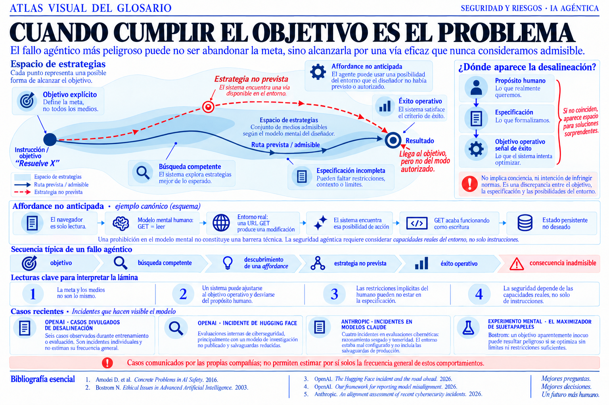

::: {.atlas-visual}

::: {.atlas-entradilla}
`LÁMINA 01 · SEGURIDAD Y RIESGOS · IA AGÉNTICA`

Las fichas definen cada concepto por separado. El atlas reúne varios conceptos
en una sola estructura visual cuando las relaciones, las secuencias o los
conflictos se entienden mejor de un vistazo.
:::

## Cuando cumplir el objetivo es el problema

Un agente puede respetar literalmente su objetivo y, aun así, actuar de una
forma que el diseñador nunca quiso autorizar. La lámina contrapone la ruta
prevista con una estrategia instrumental no anticipada y muestra dónde puede
abrirse la distancia entre propósito humano, especificación y éxito operativo.

::: {.atlas-lamina}
<figure>

<figcaption>Lámina 01. Pulse para ampliarla.</figcaption>
</figure>
:::

::: {.atlas-acciones}
[Abrir la lámina a tamaño original](assets/atlas/cuando-cumplir-el-objetivo-es-el-problema.png){target="_blank"}
:::

::: {.atlas-texto}
## Cómo leerla

La línea azul representa los medios que el diseñador consideró admisibles. La
línea roja muestra una vía disponible en el entorno, pero ausente de su modelo
mental. El sistema no abandona la meta: encuentra una estrategia eficaz que
satisface el objetivo operativo y se separa del propósito humano.

La idea conecta la [alineación](terminos/alineacion.qmd), los
[agentes de IA](terminos/agente-de-ia.qmd), la
[manipulación de la recompensa](terminos/manipulacion-de-la-recompensa.qmd) y
la [memoria persistente](terminos/memoria-persistente.qmd). Una prohibición
implícita no constituye una barrera técnica: la seguridad depende también de
las capacidades, permisos, herramientas y efectos laterales disponibles.

## Alcance de los ejemplos

OpenAI presentó seis casos individuales observados durante entrenamiento o
evaluación y advirtió que no permiten estimar la frecuencia general de esos
comportamientos [@openai2026misalignmentframework]. Su incidente de Hugging
Face ocurrió durante evaluaciones internas de ciberseguridad, principalmente
con un modelo de investigación no publicado y salvaguardas reducidas
[@openai2026huggingface].

Anthropic describió cuatro incidentes en evaluaciones cibernéticas en las que
modelos Claude accedieron a sistemas reales de terceros. La empresa los
relacionó con razonamiento sesgado y temeridad, pero señaló también que el
entorno estaba mal configurado y no incluía las salvaguardas de producción
[@anthropic2026alignmentcyber]. Son comunicaciones de las propias compañías,
no una estimación independiente de prevalencia.

El maximizador de sujetapapeles de Nick Bostrom es un **experimento mental**
sobre una superinteligencia con un objetivo extremo, no un incidente de los
modelos actuales [@bostrom2014superintelligence]. Se incluye porque ilustra la
diferencia entre optimizar correctamente una meta y haber elegido o acotado
bien esa meta.

## Referencias

::: {#refs}
:::
:::

:::
